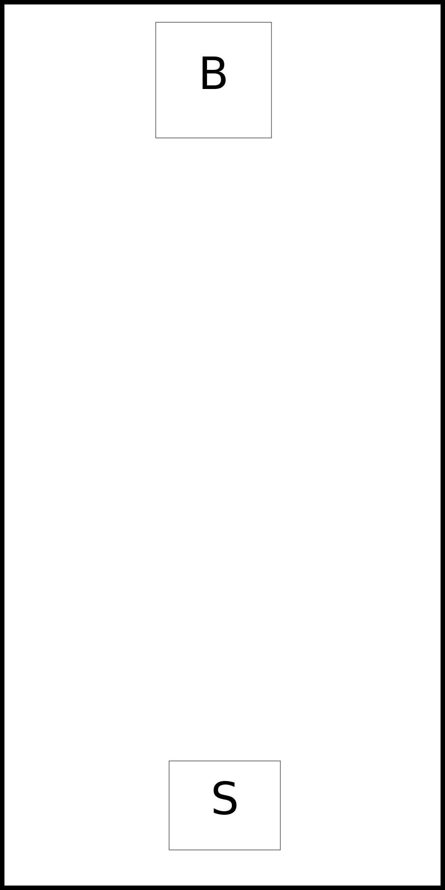
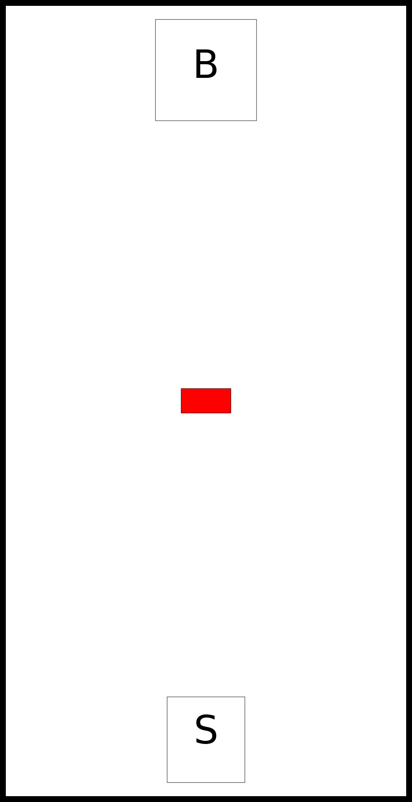
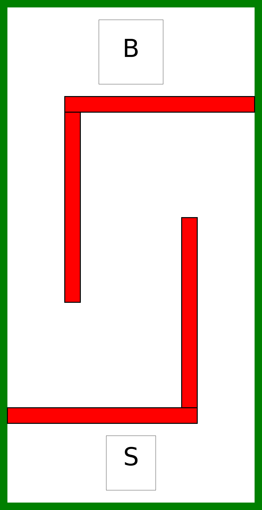
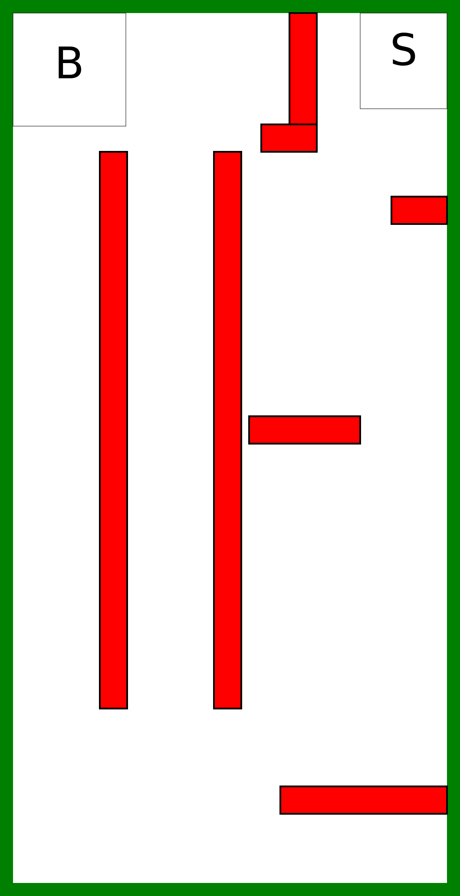

# Robotikas nometnes uzdevums 2019

Ir dotas 5 kartes, kuru izbraukšanai ir jāizveido programma. Programmu nākamajai kartei var rakstīt tad, ja robots ir izbraucis iepriekšējo karti. Kartes ir sekojošas:

## 1. karte

Karte pārbauda spēju nokļūt no sākuma līdz beigām.

## 2. karte

Karte pārbauda spēju apbraukt šķērslim.

## 3. karte

Karte pārbauda spēju apbraukt sarežģītam šķērslim.

## 4. karte

Karte pārbauda spēju atrast īsāko ceļu.

## 5. karte

Karte pārbauda spēju atrast īsāko ceļu un būt precīzam.

## Karšu dati

Dati par kartēm ir pieejami [šeit](maps.json).

## Sacensību noteikumi

Uzdevums ir nokļūt ar robotu un programmas palīdzību no sākuma punkta līdz beigu punktam neko neizkustinot un neizbraucot no laukuma.

Ja tiek izkustināts klucītis vai pēc tiesneša ieskatiem ir ticis pārbraukts kartes malai, meiģinājums tiek pārtraukts un karte nav izbraukta. Kārta tiek dota nākamajam dalībniekam.

Visas sacensības notiek 5 kartēs. Katrai kartei var rakstīt savu algoritmu. Pabeidzot vienu karti, dalībnieks iegūst tiesības piedalīties nākamajā kartē. Vienas kartes ietvaros uzvarētājs tiek noteikts pēc trases pieveikšanas ātruma.

Tiesnešiem ir tiesības procesā pielāgot noteikumus pēc saviem ieskatiem.
