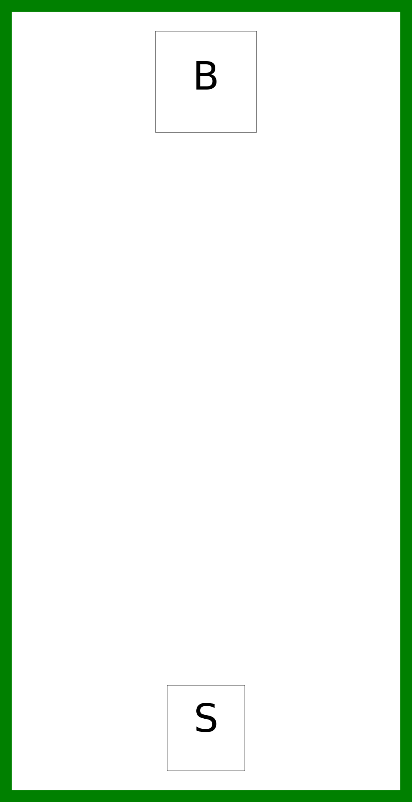
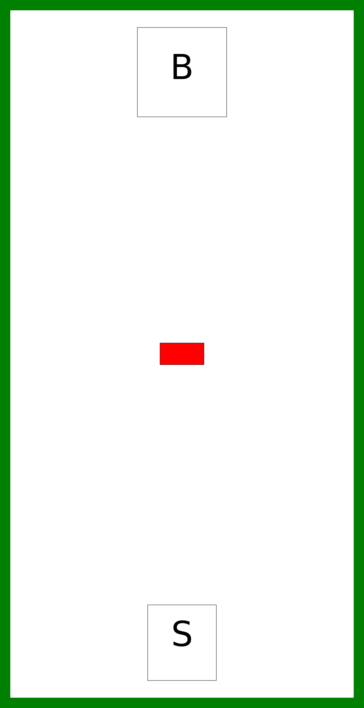

# Robotikas nometnes uzdevums 2019

Ir dotas 5 kartes, kuru izbraukšanai ir jāizveido programma. Programmu nākamajai kartei var rakstīt tad, ja robots ir izbraucis iepriekšējo karti. Kartes ir sekojošas:

## 1. karte

Karte pārbauda spēju nokļūt no sākuma līdz beigām.

## 2. karte

Karte pārbauda spēju apbraukt šķērslim.

## 3. karte

Karte pārbauda spēju apbraukt sarežģītam šķērslim.

## 4. karte

Karte pārbauda spēju atrast īsāko ceļu.

## 5. karte

Karte pārbauda spēju atrast īsāko ceļu un būt precīzam.

## Karšu dati

Dati par kartēm ir pieejami [šeit](maps.json).

## Sacensību noteikumi

Lai sasniegtu nākamo karti, ir jāuzraksta algoritms, kurš nokļūst no sākuma līdz beigu laukumam neko neizkustinot. Tajā kartē, par kuru tālāk nevar tikt, uzvarētājs tiek noteikts pēc ātrākā laika, ar kādu karte tika veikta.
