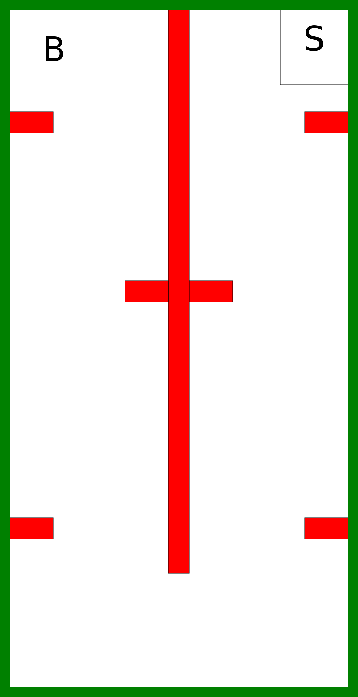

# Robotikas nometnes uzdevums 2019

Ir dotas 4 kartes, kuru izbraukšanai ir jāizveido programma. Uzdevums ir izbraukt karti pēc iespējas ātrāk. Katrā kartē tiks noskaidroti ātrākie tās veicēji. Kartes ir sekojošas:

## 1. karte

Karte pārbauda spēju nokļūt no sākuma līdz beigām.

## 2. karte

Karte pārbauda spēju apbraukt šķērslim.

## 3. karte

Karte pārbauda spēju apbraukt sarežģītam šķērslim.

## 4. karte

Karte pārbauda spēju atrast īsāko ceļu.

## Karšu dati

Dati par kartēm ir pieejami [šeit](maps.json).

